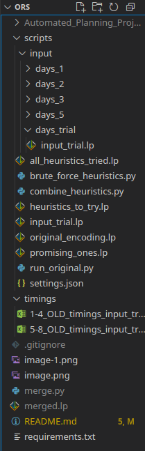
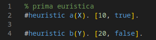
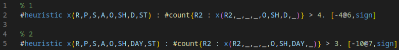

# Euristiche in ASP

---

## TLDR

I risultati sono nella [cartella timings](https://github.com/PierpaoloSpadafora/Progetto_ASP_Euristiche/tree/main/timings)
 e nella conclusione di questo README.

per eseguire il progetto:
Attivare venv di clingo
Path e argomenti sono in `settings,json`
Eseguire i file in ordine:

> `py brute_force_heuristics.py`

Lo script crea `promising_ones.lp`

> `py combine_heuristics.py`

Lo script prende le euristiche da `promising_ones.lp` e salva i risultati in `timings_{input_file_name}_.xlsx`

---

## Struttura del Progetto

il venv di clingo si trova in locale al path:  
|  
|--> folder_proj/clingo-env/bin/activate  
|  
|--> folder_proj/Progetto_ASP_Euristiche/scripts/....  

* `./input/days_trial/input_trial.lp`: Dati di input per la valutazione delle euristiche.

* `original_encoding.lp`: Encoding ASP originale del problema.

* `heuristics_to_try.lp`: Qui metto tutte le euristiche che voglio provare (anche la stessa euristica più volte con parametri diversi).
* `promising_ones.lp`: Euristiche promettenti fra quelle da provare, ovvero quelle che a parità di tempo di risoluzione trovano un AS con costo <= al baseline (encoding originale + input senza alcuna euristica)

---

### Struttura di testing

### I PATH DEI FILE E I PARAMETRI DI RISOLUZIONE SONO HARDCODATI in settings.json per semplicità, vanno cambiati a mano

* **run\_original.py**: Esegue encoding e input specificati nel file `settings.json` e restituisce in output l'elenco degli AS trovati fino a quando non dimostra che ne esistono di migliori o fino a quando non scade il tempo di risoluzione.

Fa questo RUNS-volte, definito nel file `settings.json`, per calcolare la media dei tempi.
Ha senso solo se non consideriamo più il limite di tempo e vogliamo trovare il minimo globale, applicando le euristiche non sono riuscito ad abbassare il tempo di ricerca del primo AS con costo `[2,25]`, ma ho abbassato il tempo di ricerca per assicurarmi che `[2,25]` sia il minimo globale passando da 137 secondi a circa 38 secondi.

* **brute\_force\_heuristics.py**: Come il precedente ma runna RUNS-volte i test senza nessuna euristica e poi RUNS-volte test con ciascuna euristica.
Salva in `promising_ones.lp` le euristiche che hanno migliorato il tempo di risoluzione rispetto alla baseline.

* **combine\_heuristics.py**: Prende le euristiche da `promising_ones.lp` ed esegue sempre RUNS-volte i test ma con tutte le possibili combinazioni di euristiche e salva nel file `timings_****_.xslx` i tempi di risoluzione medi per ogni combinazione trovata

---

I file devono avere un formato specifico o la regex che c'è non funziona correttamente, nello specifico:

**heuristics_to_try.lp**: ogni euristica deve essere separata da un rigo vuoto, sono ammessi commenti (verranno ignorati dal codice python) esempio:

**promising_ones.lp**: cattura <code> %Euristica [0-9]+ </code> (che viene aggiunto in automatico da brute_force_heuristics.py) fino al prossimo <code> %Euristica [0-9]+ </code>
Ignora i commenti e lo aggiunge all'encoding.
Esempio:

---

## Risultati

Ho testato prima le varie combinazioni di euristiche usando come input il contenuto del file `./input/days_1/input1.lp`.
Il baseline (= no euristiche) trova dopo circa 10 secondi il primo answer set con costo [2,25] -> minimo locale
Dopo circa 135 secondi Clingo termina, confermando che non esistono answer set con costo migliore, quindi [2,25] è anche un minimo globale.

Di tutte le euristiche che ho provato nessuna ha migliorato il tempo di risoluzione del primo AS trovato in maniera rilevante (spesso è peggiorato, ma sempre in un range troppo piccolo per essere influenza dell'euristica), ma diverse hanno migliorato il tempo di risoluzione per trovare il minimo globale con uno speedup fino a `6,65` volte più veloce rispetto al baseline.

Infine, ho scelto 3 combinazioni di euristiche:

1. `2 + 3 + 4 + 10`
2. `3 + 11`
3. `1`

ed eseguite insieme all' `original_encoding.lp` + ciascuno dei 40 file di input, salvando i risultati in `EUR_and_original_encoding_on_all_inputs.xslx`, per vedere se le euristiche sono abbastanza generiche da migliorare il tempo di risoluzione su tutti i file di input.

> Legenda:
> - Giallo: indica che è stato trovato il minimo globale prima dello scadere del timeout
> - Verde: indica che è stato trovato un AS con costo migliore o il tempo di risoluzione è stato inferiore al baseline
> - Rosso: indica che il costo degli AS o il tempo sono peggiorati rispetto al baseline (il costo 1 ha priorità più alta ed è più importante che sia verde rispetto al 2)

- Per 4 file di input su 40 è possibile trovare il minimo globale entro lo scadere del timeout
- In tutti i casi in cui viene trovato un minimo globale entro lo scadere del timeout, le configurazioni con euristiche sono più veloci rispetto al baseline
- Ci sono ancora troppi pochi dati per trarre conclusioni definitive, ma per ora sembra che le euristiche migliorino il tempo di risoluzione per trovare il minimo globale, ma in genere non migliorino o perfino peggiorano il tempo di risoluzione per trovare il primo AS con costo minimo.
