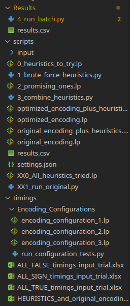
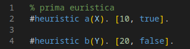
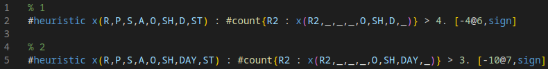
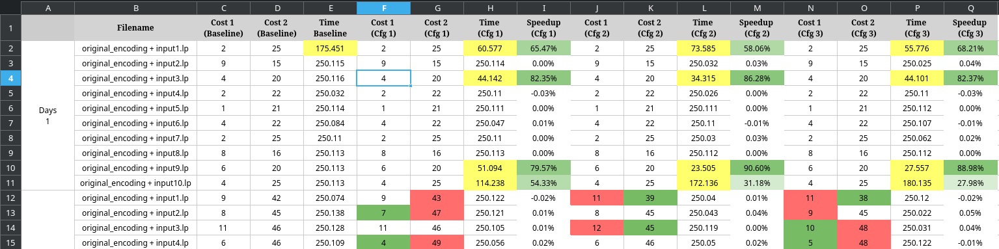

# Euristiche in ASP

## TLDR

I risultati sono nella [cartella timings](https://github.com/PierpaoloSpadafora/Progetto_ASP_Euristiche/tree/main/timings)
 e nella conclusione di questo README.

per eseguire il progetto:
1. Attivare venv di clingo
2. Path e argomenti sono in `settings,json`

Per esplorare l'utilità delle euristiche su un file nello specifico eseguire in ordine:

> `py 1_brute_force_heuristics.py`

 - Lo script legge `0_heuristics_to_try.lp`, splitta con una regex tutte le euristica contenute nel file, viene eseguito `original_encoding.lp` sul file di input specificato in `settings,json` per tracciare una baseline e poi viene rieseguita una run per ciascuna euristica estratta con le regex.
Tutte le euristiche che riducono i tempi rispetto alla baseline vengono salvati in `2_promising_ones.lp`

> `py 3_combine_heuristics.py`

 - Lo script prende le euristiche contenute in `1_promising_ones.lp`, ed esegue anche egli prima `original_encoding.lp` sul file di input specificato in `settings,json` per tracciare una baseline e poi tutte le combinazioni possibili con le euristiche trovate nel file, per vedere se più euristiche insieme possono essere più o meno promettenti e salva i risultati in `timings_{input_file_name}_.xlsx`

Per esplorare l'utilità delle euristiche su tutti i file di input eseguire in ordine:

> `py ../Results/4_run_batch.py`

 - Lo script legge `0_heuristics_to_try.lp`, splitta con una regex tutte le euristica contenute nel file, viene eseguito `original_encoding.lp` su tutti i file di input specificati in `settings,json` per tracciare una baseline e poi viene rieseguita una run per ciascuna euristica estratta con le regex.
---

## Struttura del Progetto

il venv di clingo si trova in locale al path:  
|  
|--> folder_proj/clingo-env/bin/activate  
|  
|--> folder_proj/Progetto_ASP_Euristiche/scripts/....  

---

## Dettagli

I file devono avere un formato specifico o la regex che c'è non funziona correttamente, nello specifico:

**heuristics_to_try.lp**: ogni euristica deve essere separata da un rigo vuoto, sono ammessi commenti (verranno ignorati dal codice python) esempio:

**promising_ones.lp**: cattura <code> %Euristica [0-9]+ </code> (che viene aggiunto in automatico da brute_force_heuristics.py) fino al prossimo <code> %Euristica [0-9]+ </code>
Ignora i commenti e lo aggiunge all'encoding.
Esempio:

---

## Risultati e Osservazioni
Ho iniziato testato prima varie combinazioni di euristiche usando come input il contenuto del file `./input/days_1/input1.lp`.
Il baseline (`original_encoding.lp` senza euristiche) trova dopo circa 10 secondi il primo answer set con costo [2,25] -> minimo locale
Dopo 175 secondi Clingo termina, confermando che non esistono answer set con costo migliore, quindi [2,25] è anche un minimo globale.

Di tutte le euristiche che ho provato nessuna ha migliorato il tempo di risoluzione del primo AS trovato in maniera rilevante (spesso è peggiorato, ma sempre in un range troppo piccolo per essere influenza dell'euristica), ma diverse hanno migliorato il tempo di risoluzione per trovare il minimo globale con uno speedup fino a `6,65` volte più veloce rispetto al baseline.

Infine, ho scelto 3 combinazioni di euristiche, in ordine di tempo di risoluzione:

1. `2 + 3 + 4 + 10`
2. `3 + 11`
3. `1`

ed eseguite insieme all' `original_encoding.lp` + ciascuno dei 40 file di input, salvando i risultati in `EUR_and_original_encoding_on_all_inputs.xslx`, per vedere se le euristiche sono abbastanza generiche da migliorare il tempo di risoluzione su tutti i file di input.

> Legenda:
> - Giallo: indica che è stato trovato il minimo globale prima dello scadere del timeout
> - Verde: indica che è stato trovato un AS con costo migliore o il tempo di risoluzione è stato inferiore al baseline
> - Rosso: indica che il costo degli AS o il tempo sono peggiorati rispetto al baseline (il costo 1 ha priorità più alta ed è più importante che sia verde rispetto al 2)

- Per 4 file di input su 40 è possibile trovare il minimo globale entro lo scadere del timeout
- In tutti i casi in cui viene trovato un minimo globale entro lo scadere del timeout, le configurazioni con euristiche sono più veloci rispetto al baseline
- Sembra che le euristiche migliorino il tempo di risoluzione per trovare il minimo globale, ma in genere non migliorino o perfino peggiorano il tempo di risoluzione per trovare il primo AS con costo minimo.

Per trarre delle conclusioni più dettagliate ho deciso di provare ad eseguire sia `origina_encoding.lp` che `optimized_encoding.lp` su tutti i file di input con 180 secondi di timer e poi sia `original_encoding_plus_heuristics.lp` che `optimized_encoding_plus_heuristics.lp` che sono gli stessi script ma con l'aggiunta di una singola euristica, quella che dai dati sembra la più efficiente di tutte.

Dopo un totale di 8 ore di esecuzione, ho ottenuto i seguenti risultati
